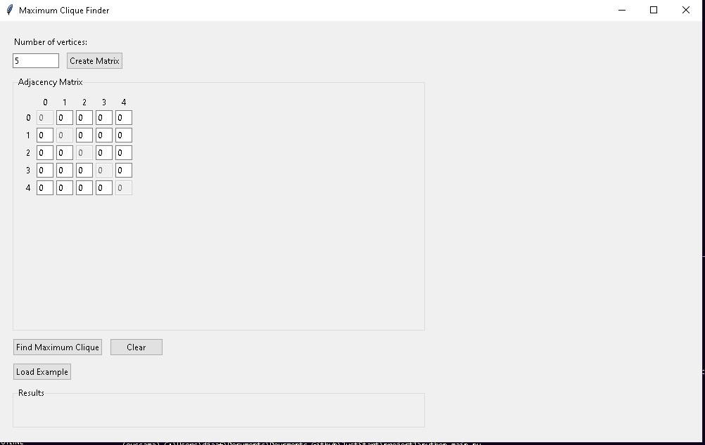
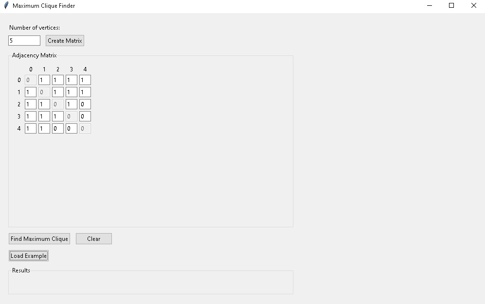
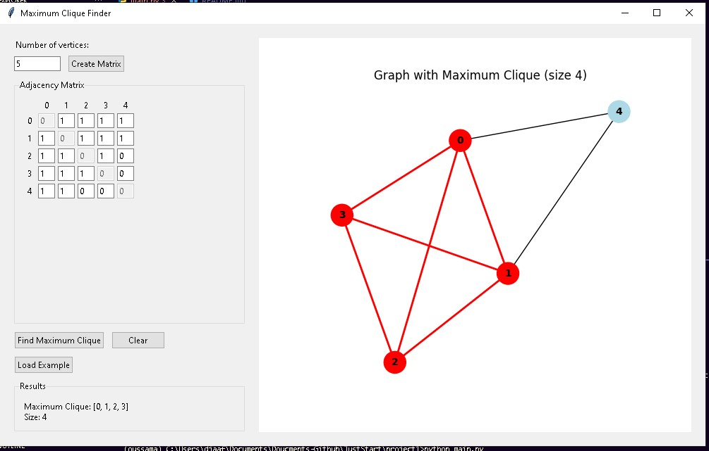

# Maximum Clique Finder

A Python application with GUI interface to find and visualize the maximum clique in an undirected graph.

## Description

This program provides a graphical interface for finding the maximum clique in an undirected graph. A clique is a subset of vertices in a graph where every two vertices are connected by an edge. The maximum clique is the largest such subset.

## Features

- Interactive adjacency matrix input
- Dynamic graph size (up to 15 vertices)
- Real-time graph visualization
- Maximum clique highlighting
- Example graph loading
- Clear matrix functionality

## How to Use

1. **Set Graph Size**
   - Enter the number of vertices (1-15)
   - Click "Create Matrix" to generate the input matrix
   

2. **Input Graph Structure**
   - Fill the adjacency matrix with 0s and 1s
   - 1 indicates an edge exists between vertices
   - 0 indicates no edge
   - Matrix is automatically made symmetric
   - Diagonal entries are locked to 0 (no self-loops)
   

3. **Find Maximum Clique**
   - Click "Find Maximum Clique" to compute the result
   - The maximum clique will be displayed in the Results section
   - A visualization appears showing:
     - Red nodes: vertices in the maximum clique
     - Red edges: edges in the maximum clique
     - Blue nodes: vertices not in the maximum clique
   

4. **Additional Features**
   - "Load Example" button provides a sample graph
   - "Clear" button resets the matrix to all zeros
   

## Screenshots

### Main Interface

*The main application interface showing the adjacency matrix and graph visualization*

### Example Graph

*A loaded example graph with its maximum clique highlighted*

### Results View

*Detailed view of the maximum clique computation results*

## Technical Details

The program uses:
- `tkinter` for the GUI
- `networkx` for graph operations
- `matplotlib` for visualization
- Backtracking algorithm for finding maximum clique

## Requirements

```python
pip install networkx matplotlib
```

## Algorithm

The maximum clique is found using a backtracking algorithm that:
1. Explores all possible combinations of vertices
2. Prunes branches that cannot lead to a larger clique
3. Maintains the best solution found so far

## Performance

- Optimal for small to medium graphs (up to 15 vertices)
- NP-hard problem, so larger graphs may experience performance issues
